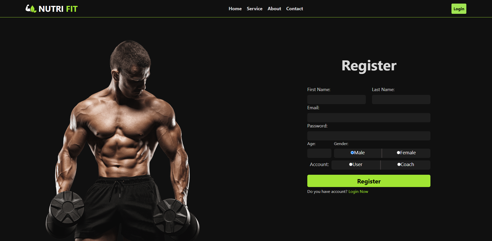
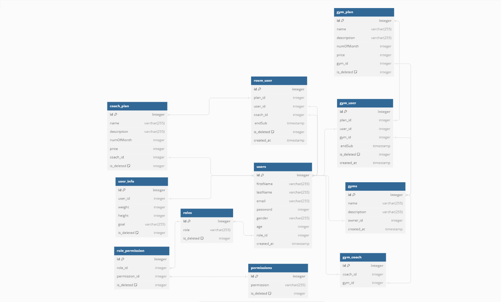

<p align="center">
<a href="https://www.meraki-academy.org" target="_blank" rel="noopener noreferrer">
 
 </a>
</p>

<h3 align="center">NutriFit
</h3>

---

<p align="center"> NutriFit is a revolutionary Website designed to help users track their nutrition and fitness goals seamlessly. With NutriFit, you can easily monitor your daily food intake, set personalized nutrition targets, and stay motivated on your journey to a healthier lifestyle 
    <br> 
<a href=''>Demo</a>
    <br> 
</p>

## 📝 Table of Contents

- [About](#about)
- [Getting Started](#getting_started)
- [Usage](#usage)
- [Built Using](#built_using)
- [User Story](#user_story)
- [Data Flow](#data_flow)
- [Guided By](#guided_by)

## 🧐 About <a name = "about"></a>


The NutriFit app is a comprehensive solution designed to empower individuals on their journey towards better health and fitness. Our purpose is to simplify the process of achieving nutrition and fitness goals by providing users with intuitive tools and personalized guidance. Whether you're looking to lose weight, gain muscle, or simply improve your overall well-being, NutriFit offers a holistic approach that encompasses food tracking, meal planning, activity monitoring, and community support. By harnessing the power of technology, we aim to make healthy living accessible and enjoyable for everyone, helping users make informed choices about their diet and lifestyle. With NutriFit, you can take control of your health, set meaningful goals, and embark on a transformative journey towards a happier, healthier you

## 🏁 Getting Started <a name = "getting_started"></a>

These instructions will get you a copy of the project up and running on your local machine for development and testing purposes.

### Prerequisites

- Visual Studio Code follow this <a href='https://code.visualstudio.com/'>link</a> to install.
- Git Bash follow this <a href='https://git-scm.com/download/win'>link</a> to install.
- MongoDB follow this <a href='https://www.mongodb.com/try/download/community'>link</a> to install.
- Node.js follow this <a href='https://nodejs.org/en/download'>link</a> to install.

### Installing:

1. Clone the repo to your local machine using git bash.

```
git clonehttps://github.com/TheAnglesTeam/MERAKI_Academy_Project_5.git
```

2. Install packeges repeat this step in backend and frontend folder

```
npm i
```

3. Run server using git bash inside backend folder

```
npm run dev
```

4. Run application using git bash inside frontend folder

```
npm run start
```

Now app ready to use

## 🎈 Usage <a name="usage"></a>


- You can click on the **Home** tab provided in the navigation bar to view the home section

- You can click on the **JOIN NOW** button to register in our website

## ⛏️ Built Using <a name = "built_using"></a>

- [MongoDB](https://www.mongodb.com/) - Database
- [Express JS](https://expressjs.com/) - Server Framework
- [React JS](https://https://reactjs.org/) - Web Framework
- [Node JS](https://nodejs.org/en/) - Server Environment

## User Story <a name = "#user_story"></a>

Your trello board link
<a href=''>Trello</a>

## Data Flow <a name = "#data_flow"></a>



## ⚠️ Guided By <a name = "guided_by"></a>

This project is guided by ©️ **[MERAKI Academy](https://www.meraki-academy.org)**